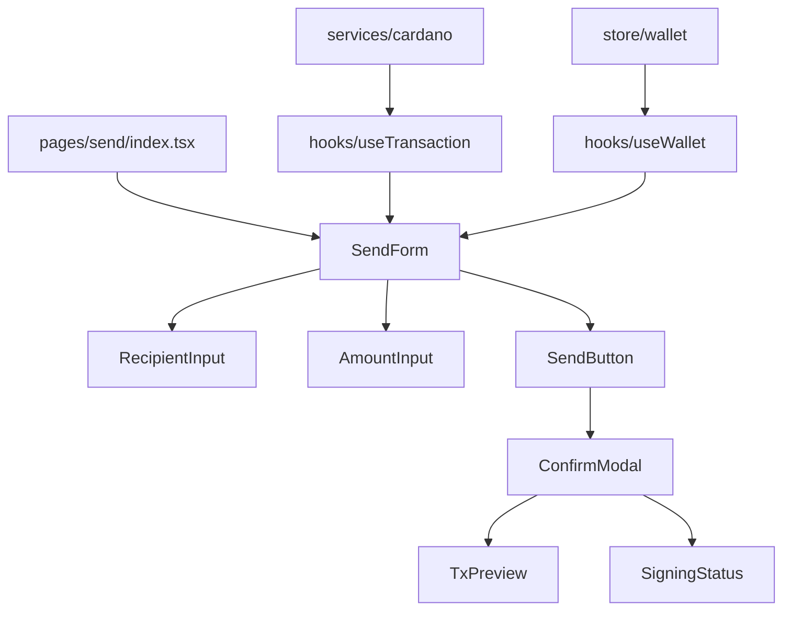

# 카르다노 dApp - 유니스왑 스타일 아키텍처

> 입문/학습용 카르다노 dApp 개발 프로젝트  
> 유니스왑 스타일의 확장 가능한 아키텍처로 구성

## 🦄 유니스왑 스타일 dApp 구조

### 📁 **전체 디렉토리 구조**

```
frontend/
├── src/
│   ├── pages/                    # 라우팅 페이지들
│   │   ├── index.tsx            # 홈/대시보드
│   │   ├── wallet/
│   │   │   └── index.tsx        # 지갑 관리 페이지
│   │   ├── send/
│   │   │   └── index.tsx        # 송금 페이지
│   │   └── history/
│   │       └── index.tsx        # 거래 내역 페이지
│   │
│   ├── components/               # UI 컴포넌트들
│   │   ├── common/              # 공통 컴포넌트
│   │   │   ├── Button/
│   │   │   ├── Card/
│   │   │   ├── Modal/
│   │   │   ├── Loading/
│   │   │   └── Layout/
│   │   ├── wallet/              # 지갑 관련 컴포넌트
│   │   │   ├── WalletConnect/
│   │   │   ├── WalletInfo/
│   │   │   ├── BalanceDisplay/
│   │   │   └── NetworkSelector/
│   │   ├── transaction/         # 트랜잭션 관련
│   │   │   ├── SendForm/
│   │   │   ├── TransactionCard/
│   │   │   ├── TransactionList/
│   │   │   └── ConfirmModal/
│   │   └── forms/               # 폼 컴포넌트들
│   │       ├── AddressInput/
│   │       ├── AmountInput/
│   │       └── FormField/
│   │
│   ├── hooks/                   # 비즈니스 로직 훅들
│   │   ├── useWallet.ts         # 지갑 관련 로직
│   │   ├── useBalance.ts        # 잔액 관련 로직
│   │   ├── useTransaction.ts    # 트랜잭션 관련 로직
│   │   ├── useCardano.ts        # 카르다노 관련 로직
│   │   └── useLocalStorage.ts   # 로컬 스토리지 관리
│   │
│   ├── services/                # 외부 API & 블록체인 통신
│   │   ├── blockfrost.ts        # Blockfrost API 서비스
│   │   ├── cardano.ts           # 카르다노 블록체인 서비스
│   │   ├── wallet.ts            # 지갑 연동 서비스
│   │   └── transaction.ts       # 트랜잭션 서비스
│   │
│   ├── store/                   # 전역 상태 관리
│   │   ├── wallet/              # 지갑 상태
│   │   │   ├── walletSlice.ts
│   │   │   └── walletActions.ts
│   │   ├── transaction/         # 트랜잭션 상태
│   │   │   ├── transactionSlice.ts
│   │   │   └── transactionActions.ts
│   │   └── ui/                  # UI 상태
│   │       ├── uiSlice.ts
│   │       └── modals.ts
│   │
│   ├── utils/                   # 유틸리티 함수들
│   │   ├── format.ts            # 포맷팅 함수들
│   │   ├── validation.ts        # 검증 함수들
│   │   ├── constants.ts         # 상수들
│   │   ├── cardano.ts          # 카르다노 유틸리티
│   │   └── errors.ts           # 에러 핸들링
│   │
│   └── types/                   # 타입 정의들
│       ├── wallet.ts            # 지갑 관련 타입
│       ├── transaction.ts       # 트랜잭션 관련 타입
│       ├── cardano.ts          # 카르다노 관련 타입
│       └── api.ts              # API 관련 타입
│
├── public/                      # 정적 파일들
└── .env                         # 환경변수
```

## 🧩 **핵심 컴포넌트들 (개발 우선순위별)**

### **1단계: 기본 인프라 컴포넌트**

```
components/common/
├── Layout/
│   ├── Header.tsx              # 상단 헤더
│   ├── Footer.tsx              # 하단 푸터
│   └── Sidebar.tsx             # 사이드바 (모바일용)
├── Button/
│   ├── PrimaryButton.tsx       # 주요 버튼
│   ├── SecondaryButton.tsx     # 보조 버튼
│   └── IconButton.tsx          # 아이콘 버튼
├── Card/
│   ├── BaseCard.tsx            # 기본 카드
│   └── StatsCard.tsx           # 통계 카드
├── Modal/
│   ├── BaseModal.tsx           # 기본 모달
│   └── ConfirmModal.tsx        # 확인 모달
└── Loading/
    ├── Spinner.tsx             # 로딩 스피너
    └── Skeleton.tsx            # 스켈레톤 로더
```

### **2단계: 지갑 관련 컴포넌트**

```
components/wallet/
├── WalletConnect/
│   ├── WalletButton.tsx        # 개별 지갑 버튼
│   ├── WalletList.tsx          # 지갑 목록
│   └── ConnectModal.tsx        # 연결 모달
├── WalletInfo/
│   ├── AddressDisplay.tsx      # 주소 표시
│   ├── NetworkBadge.tsx        # 네트워크 표시
│   └── DisconnectButton.tsx    # 연결 해제 버튼
├── BalanceDisplay/
│   ├── AdaBalance.tsx          # ADA 잔액
│   ├── TokenBalance.tsx        # 토큰 잔액 (나중에)
│   └── RefreshButton.tsx       # 새로고침 버튼
└── NetworkSelector/
    └── NetworkDropdown.tsx     # 네트워크 선택
```

### **3단계: 트랜잭션 관련 컴포넌트**

```
components/transaction/
├── SendForm/
│   ├── RecipientInput.tsx      # 수신자 주소 입력
│   ├── AmountInput.tsx         # 금액 입력
│   ├── FeeDisplay.tsx          # 수수료 표시
│   └── SendButton.tsx          # 전송 버튼
├── TransactionCard/
│   ├── TxSummary.tsx           # 트랜잭션 요약
│   ├── TxStatus.tsx            # 상태 표시
│   └── TxDetails.tsx           # 상세 정보
├── TransactionList/
│   ├── TxListItem.tsx          # 개별 거래 항목
│   ├── TxFilter.tsx            # 필터 옵션
│   └── Pagination.tsx          # 페이지네이션
└── ConfirmModal/
    ├── TxPreview.tsx           # 거래 미리보기
    ├── FeeBreakdown.tsx        # 수수료 분석
    └── SigningStatus.tsx       # 서명 상태
```

### **4단계: 폼 관련 컴포넌트**

```
components/forms/
├── AddressInput/
│   ├── AddressField.tsx        # 주소 입력 필드
│   ├── AddressValidator.tsx    # 주소 검증 표시
│   └── QRScanner.tsx          # QR 코드 스캐너 (나중에)
├── AmountInput/
│   ├── AmountField.tsx         # 금액 입력 필드
│   ├── MaxButton.tsx           # 최대값 버튼
│   └── CurrencySelector.tsx    # 통화 선택
└── FormField/
    ├── Label.tsx               # 라벨
    ├── ErrorMessage.tsx        # 에러 메시지
    └── HelpText.tsx           # 도움말 텍스트
```

## 🔄 **컴포넌트 간 데이터 플로우**



## 📋 **개발 체크리스트**

### **Phase 1: 기본 구조** (1-2시간)

- [ ] Layout 컴포넌트들
- [ ] 기본 UI 컴포넌트들 (Button, Card, Modal)
- [ ] 페이지 라우팅 설정

### **Phase 2: 지갑 연동** (2-3시간)

- [ ] WalletConnect 컴포넌트들
- [ ] WalletInfo 컴포넌트들
- [ ] BalanceDisplay 컴포넌트들
- [ ] useWallet 훅

### **Phase 3: 송금 기능** (3-4시간)

- [ ] SendForm 컴포넌트들
- [ ] TransactionCard 컴포넌트들
- [ ] ConfirmModal 컴포넌트들
- [ ] useTransaction 훅

## 🎯 **아키텍처 특징**

### **확장성**

- 컴포넌트별 독립적 개발 가능
- 새로운 기능 추가 시 기존 코드 영향 최소화
- 재사용 가능한 컴포넌트 구조

### **유지보수성**

- 관심사 분리 (UI/로직/데이터)
- 타입 안전성 보장
- 일관된 코딩 패턴

### **개발 효율성**

- 병렬 개발 가능한 구조
- 테스트 용이성
- 디버깅 편의성

---

**개발 시작**: 유니스왑 스타일의 확장 가능한 아키텍처로 카르다노 dApp 구축  
**목표**: 학습용이면서도 실제 프로덕션에서 사용할 수 있는 구조
