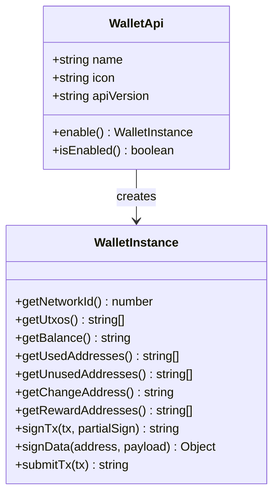

# API 레퍼런스

## 서비스 API 명세

### WalletService

| 메서드                         | 파라미터 | 반환값                | 설명                       |
| ------------------------------ | -------- | --------------------- | -------------------------- |
| `getAvailableWallets()`        | -        | `WalletInfo[]`        | 사용 가능한 지갑 목록 조회 |
| `isWalletInstalled(walletKey)` | `string` | `boolean`             | 지갑 설치 여부 확인        |
| `connectWallet(walletKey)`     | `string` | `ConnectedWalletInfo` | 지갑 연결                  |
| `isWalletEnabled(walletKey)`   | `string` | `boolean`             | 지갑 활성화 여부 확인      |
| `lovelaceToAda(lovelace)`      | `string` | `string`              | Lovelace → ADA 변환        |
| `adaToLovelace(ada)`           | `number` | `string`              | ADA → Lovelace 변환        |

### SendService

| 메서드                             | 파라미터                                  | 반환값              | 설명                |
| ---------------------------------- | ----------------------------------------- | ------------------- | ------------------- |
| `sendTransaction(wallet, params)`  | `WalletInstance`, `SendTransactionParams` | `TransactionResult` | 송금 실행           |
| `validateAddress(address)`         | `string`                                  | `boolean`           | 주소 유효성 검증    |
| `estimateFee(amount, hasMetadata)` | `number`, `boolean`                       | `number`            | 수수료 추정         |
| `adaToLovelace(ada)`               | `number`                                  | `string`            | ADA → Lovelace 변환 |

### TransactionService

| 메서드                                                | 파라미터                                           | 반환값               | 설명           |
| ----------------------------------------------------- | -------------------------------------------------- | -------------------- | -------------- |
| `getTransactionHistory(address, page, count, filter)` | `string`, `number`, `number`, `TransactionFilter?` | `TransactionHistory` | 거래내역 조회  |
| `getTransactionDetails(txHash, userAddress)`          | `string`, `string`                                 | `Transaction`        | 거래 상세 정보 |

## 데이터 타입 정의

### 기본 타입

```typescript
interface WalletInfo {
  key: string;
  name: string;
  icon: string;
  isInstalled: boolean;
}

interface ConnectedWalletInfo {
  name: string;
  address: string;
  balance: string;
  networkId: number;
  api: WalletInstance;
}

interface SendTransactionParams {
  recipientAddress: string;
  amount: number; // ADA 단위
  memo?: string;
}

interface TransactionResult {
  txHash: string;
  fee: string; // ADA 단위
}
```

### CIP-30 인터페이스



## 에러 코드 정의

| 코드                   | 타입             | 메시지                         | 해결방법               |
| ---------------------- | ---------------- | ------------------------------ | ---------------------- |
| `WALLET_NOT_INSTALLED` | WalletError      | "지갑이 설치되지 않았습니다"   | 지갑 설치 안내         |
| `WALLET_NOT_ENABLED`   | WalletError      | "지갑 연결을 승인해주세요"     | 지갑에서 승인 요청     |
| `INVALID_NETWORK`      | NetworkError     | "네트워크를 전환해주세요"      | 올바른 네트워크로 전환 |
| `INSUFFICIENT_FUNDS`   | TransactionError | "잔액이 부족합니다"            | 충분한 ADA 확보        |
| `INVALID_ADDRESS`      | ValidationError  | "올바르지 않은 주소입니다"     | 주소 형식 확인         |
| `USER_REJECTED`        | UserError        | "사용자가 취소했습니다"        | 재시도 안내            |
| `NETWORK_ERROR`        | NetworkError     | "네트워크 오류가 발생했습니다" | 네트워크 상태 확인     |

## 상수 정의

### shared/utils/constants

```typescript
// 네트워크 설정
export const CARDANO_NETWORKS = {
  MAINNET: { id: 1, name: 'mainnet', displayName: 'Mainnet' },
  PREVIEW: { id: 0, name: 'preview', displayName: 'Preview Testnet' },
  PREPROD: { id: 0, name: 'preprod', displayName: 'Preprod Testnet' },
};

// 현재 네트워크
export const CURRENT_NETWORK = CARDANO_NETWORKS.PREVIEW;

// 지갑 목록
export const SUPPORTED_WALLETS = [
  { key: 'lace', name: 'Lace', icon: '/wallets/lace.svg' },
  { key: 'nami', name: 'Nami', icon: '/wallets/nami.svg' },
  { key: 'eternl', name: 'Eternl', icon: '/wallets/eternl.svg' },
];

// 트랜잭션 설정
export const TRANSACTION_CONFIG = {
  MIN_UTXO_VALUE: 1_000_000, // 1 ADA in lovelace
  DEFAULT_FEE_ESTIMATE: 0.2, // ADA
  MAX_TX_SIZE: 16384,
  TTL_HOURS: 1,
};
```
