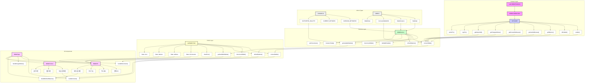

# CIP-30 기반 지갑 연결 아키텍처

## 상세 함수 구조 다이어그램

```mermaid
graph TD
    subgraph "Browser Layer"
        A["Lace Wallet Extension"] --> B["window.cardano.lace"]
        B --> C["CIP-30 API"]
        C --> C1["enable()"]
        C --> C2["isEnabled()"]
        C --> C3["getBalance()"]
        C --> C4["getUsedAddresses()"]
        C --> C5["getUnusedAddresses()"]
        C --> C6["getChangeAddress()"]
        C --> C7["getNetworkId()"]
        C --> C8["signTx()"]
        C --> C9["submitTx()"]
    end

    subgraph "Services Layer"
        H["WalletService"]
        H --> H1["getAvailableWallets()"]
        H --> H2["connectWallet()"]
        H --> H3["isWalletEnabled()"]
        H --> H4["disconnectWallet()"]
        H --> H5["refreshBalance()"]
        H --> H6["lovelaceToAda()"]
        H --> H7["adaToLovelace()"]
    end

    subgraph "Hooks Layer"
        G["useWallet Hook"]
        G --> G1["connectWallet()"]
        G --> G2["disconnectWallet()"]
        G --> G3["refreshBalance()"]
        G --> G4["getAvailableWallets()"]
        G --> G5["clearError()"]
        G --> G6["State: isConnected"]
        G --> G7["State: address"]
        G --> G8["State: balance"]
        G --> G9["State: error"]
    end

    subgraph "UI Components"
        D["WalletPage"]
        D --> D1["handleConnect()"]
        D --> D2["handleDisconnect()"]
        D --> D3["handleCopyAddress()"]
        D --> D4["handleRefreshBalance()"]

        E["WalletConnect"]
        E --> E1["지갑 설치 확인"]
        E --> E2["연결 버튼"]
        E --> E3["설치 버튼"]

        F["WalletInfo"]
        F --> F1["잔액 표시"]
        F --> F2["주소 표시"]
        F --> F3["복사 기능"]
        F --> F4["새로고침 버튼"]
    end

    subgraph "Utils & Types"
        I["constants.ts"]
        I --> I1["CARDANO_NETWORKS"]
        I --> I2["CURRENT_NETWORK"]
        I --> I3["SUPPORTED_WALLETS"]

        J["wallet.ts"]
        J --> J1["WalletApi"]
        J --> J2["WalletInstance"]
        J --> J3["ConnectedWalletInfo"]
        J --> J4["WalletState"]
    end

    C1 --> H2
    C3 --> H5
    C4 --> H2
    C5 --> H2
    C6 --> H2
    C7 --> H2

    H2 --> G1
    H5 --> G3
    H1 --> G4

    G1 --> D1
    G2 --> D2
    G3 --> D4
    G4 --> E
    G6 --> F
    G7 --> F
    G8 --> F

    D --> E
    D --> F
    E1 --> D1
    F4 --> D4

    I1 --> H
    I3 --> H1
    J1 --> H
    J2 --> H
    J3 --> H2

    classDef browser fill:#f9f,stroke:#333,stroke-width:2px,color:#000
    classDef api fill:#ccf,stroke:#333,stroke-width:2px,color:#000
    classDef service fill:#cfc,stroke:#333,stroke-width:2px,color:#000
    classDef hook fill:#ffc,stroke:#333,stroke-width:2px,color:#000
    classDef ui fill:#fcf,stroke:#333,stroke-width:2px,color:#000
    classDef util fill:#eee,stroke:#333,stroke-width:2px,color:#000
    classDef method fill:#fff,stroke:#666,stroke-width:1px,color:#000

    class A,B browser
    class C api
    class H service
    class G hook
    class D,E,F ui
    class I,J util
    class C1,C2,C3,C4,C5,C6,C7,C8,C9,H1,H2,H3,H4,H5,H6,H7,G1,G2,G3,G4,G5,G6,G7,G8,G9,D1,D2,D3,D4,E1,E2,E3,F1,F2,F3,F4,I1,I2,I3,J1,J2,J3,J4 method
```
