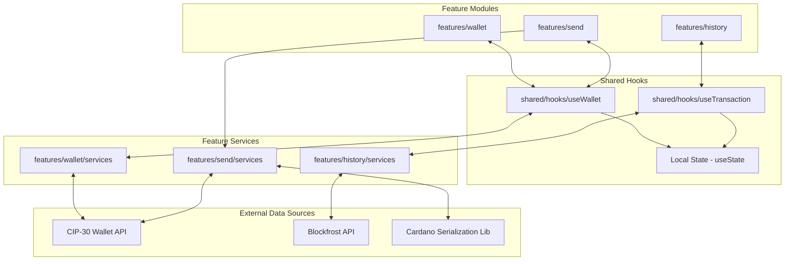
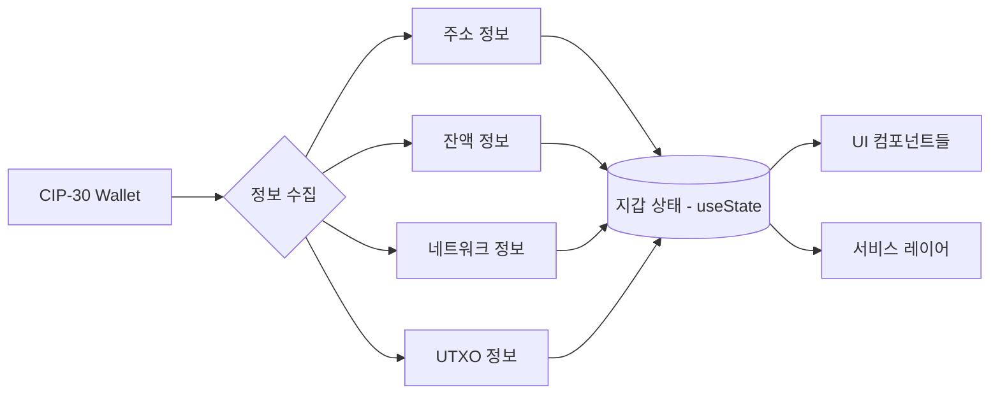
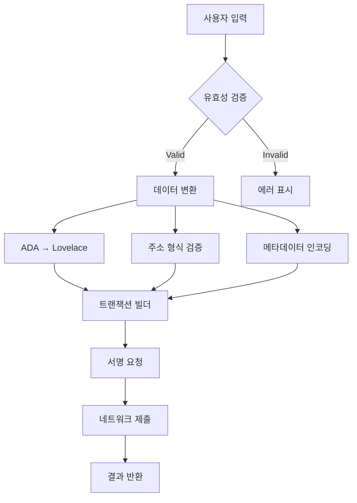
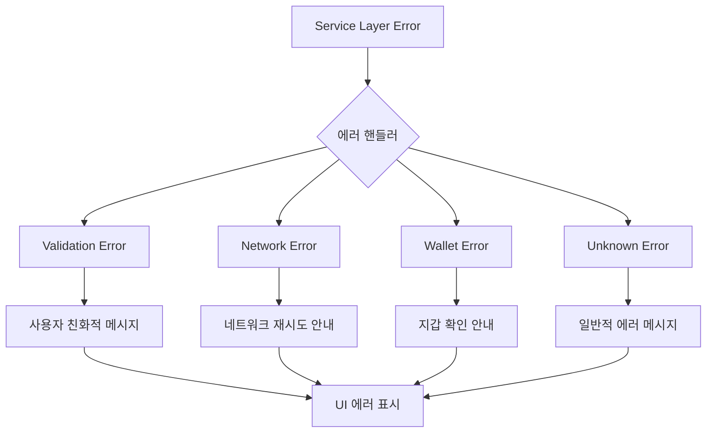
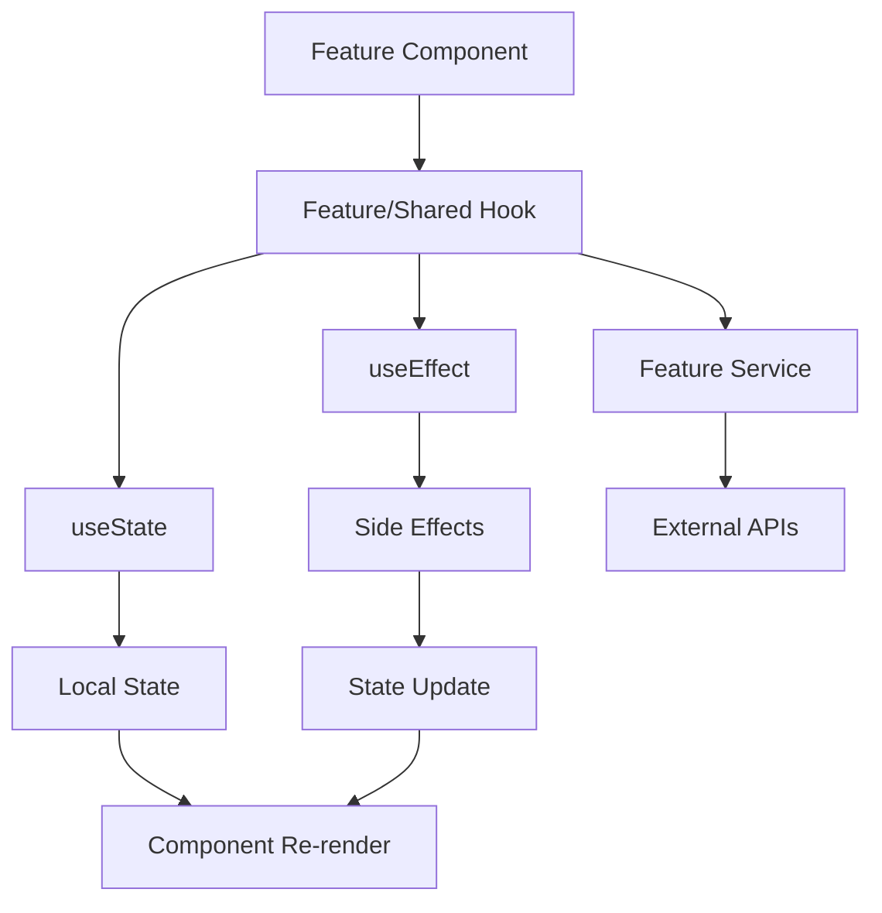

# 데이터 플로우 다이어그램

## 전체 데이터 흐름

## 지갑 상태 데이터 플로우

## 송금 데이터 변환 과정

## 상태 업데이트 매트릭스

| 액션              | 지갑 상태 (useState) | 거래 상태 (useState) | UI 상태 (로컬) |
| ----------------- | -------------------- | -------------------- | -------------- |
| **지갑 연결**     | ✅ 업데이트          | ➖ 변화없음          | ✅ 로딩 상태   |
| **잔액 새로고침** | ✅ 잔액만            | ➖ 변화없음          | ✅ 로딩 상태   |
| **송금 실행**     | ➖ 변화없음          | ✅ 진행 상태         | ✅ 로딩 상태   |
| **송금 완료**     | ⏳ 자동 새로고침     | ✅ 완료 상태         | ✅ 성공 메시지 |
| **거래내역 조회** | ➖ 변화없음          | ✅ 업데이트          | ✅ 로딩 상태   |

## 에러 전파 경로

## Feature-based React Hook 상태 관리

