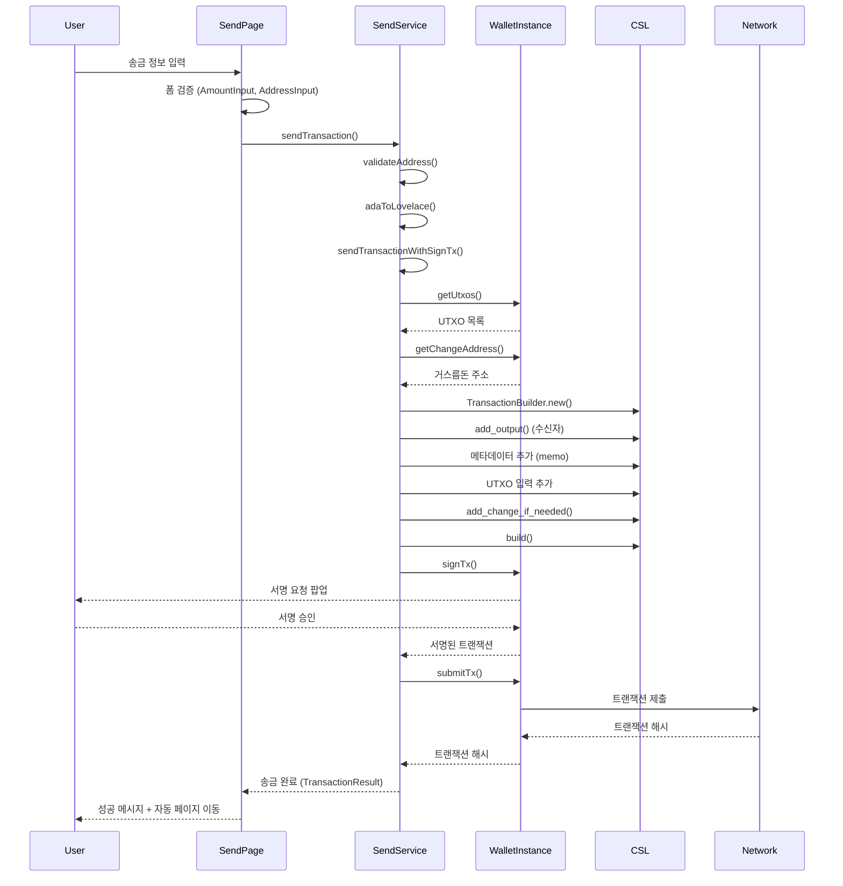
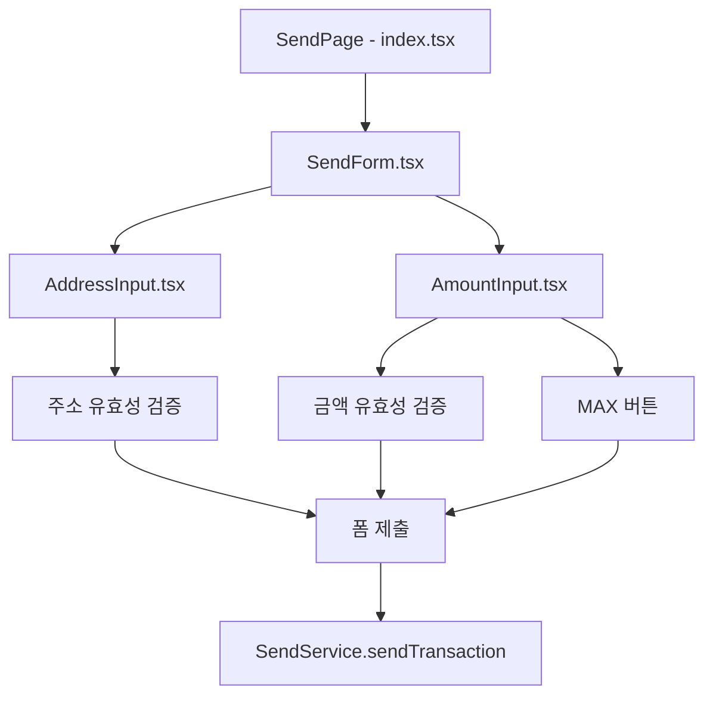
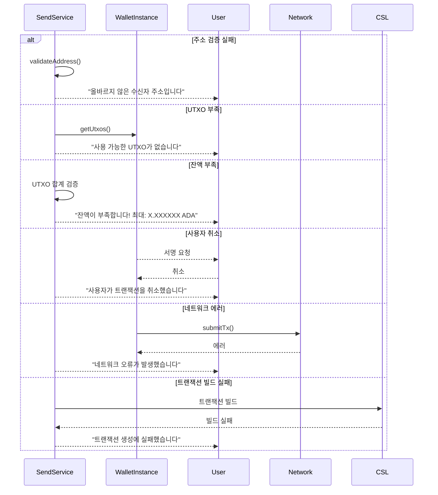
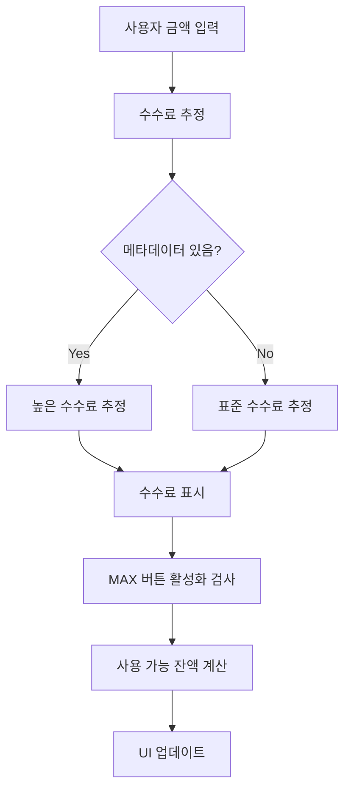
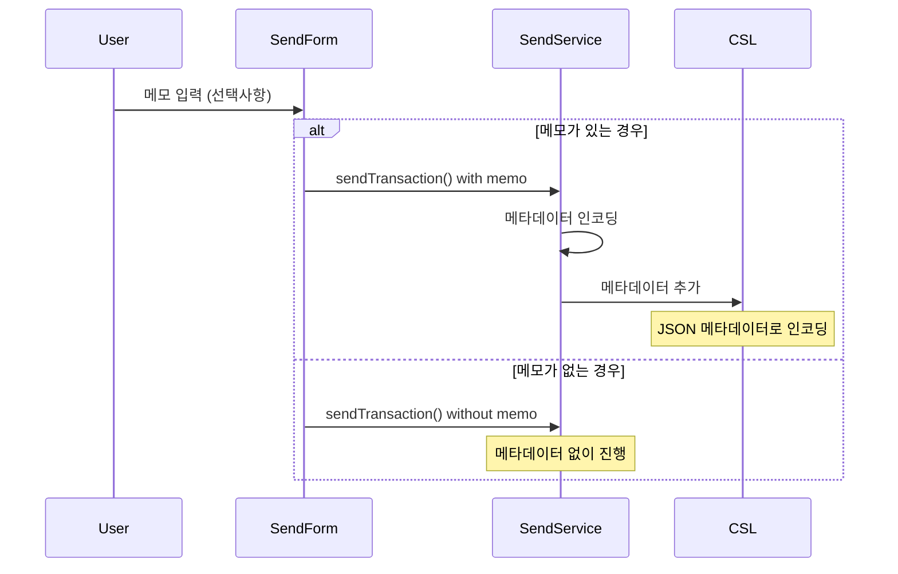
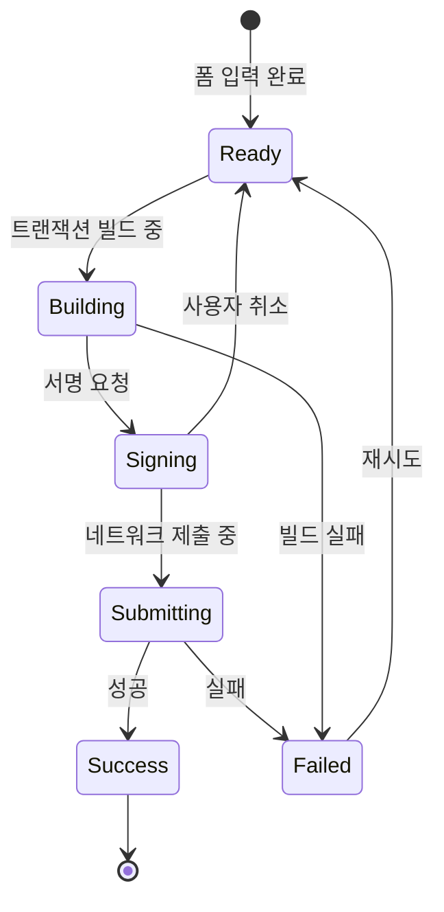

# 송금 시퀀스 다이어그램

## 송금 프로세스 전체 플로우

```mermaid
sequenceDiagram
    participant User
    participant SendPage
    participant SendService
    participant WalletInstance
    participant CSL
    participant Network

    User->>SendPage: 송금 정보 입력
    SendPage->>SendPage: 폼 검증 (AmountInput, AddressInput)
    SendPage->>SendService: sendTransaction()

    SendService->>SendService: validateAddress()
    SendService->>SendService: adaToLovelace()
    SendService->>SendService: sendTransactionWithSignTx()

    SendService->>WalletInstance: getUtxos()
    WalletInstance-->>SendService: UTXO 목록

    SendService->>WalletInstance: getChangeAddress()
    WalletInstance-->>SendService: 거스름돈 주소

    SendService->>CSL: TransactionBuilder.new()
    SendService->>CSL: add_output() (수신자)
    SendService->>CSL: 메타데이터 추가 (memo)
    SendService->>CSL: UTXO 입력 추가
    SendService->>CSL: add_change_if_needed()
    SendService->>CSL: build()

    SendService->>WalletInstance: signTx()
    WalletInstance-->>User: 서명 요청 팝업
    User-->>WalletInstance: 서명 승인
    WalletInstance-->>SendService: 서명된 트랜잭션

    SendService->>WalletInstance: submitTx()
    WalletInstance->>Network: 트랜잭션 제출
    Network-->>WalletInstance: 트랜잭션 해시
    WalletInstance-->>SendService: 트랜잭션 해시

    SendService-->>SendPage: 송금 완료 (TransactionResult)
    SendPage-->>User: 성공 메시지 + 자동 페이지 이동
```

## 송금 페이지 컴포넌트 구조

```mermaid
flowchart TD
    SendPage[SendPage - index.tsx] --> SendForm[SendForm.tsx]
    SendForm --> AddressInput[AddressInput.tsx]
    SendForm --> AmountInput[AmountInput.tsx]

    AddressInput --> Validation1[주소 유효성 검증]
    AmountInput --> Validation2[금액 유효성 검증]
    AmountInput --> MaxButton[MAX 버튼]

    Validation1 --> FormSubmit[폼 제출]
    Validation2 --> FormSubmit
    MaxButton --> FormSubmit

    FormSubmit --> SendService[SendService.sendTransaction]
```

## 에러 처리 플로우

```mermaid
sequenceDiagram
    participant SendService
    participant WalletInstance
    participant User

    alt 주소 검증 실패
        SendService->>SendService: validateAddress()
        SendService-->>User: "올바르지 않은 수신자 주소입니다"
    else UTXO 부족
        SendService->>WalletInstance: getUtxos()
        SendService-->>User: "사용 가능한 UTXO가 없습니다"
    else 잔액 부족
        SendService->>SendService: UTXO 합계 검증
        SendService-->>User: "잔액이 부족합니다! 최대: X.XXXXXX ADA"
    else 사용자 취소
        WalletInstance-->>User: 서명 요청
        User-->>WalletInstance: 취소
        SendService-->>User: "사용자가 트랜잭션을 취소했습니다"
    else 네트워크 에러
        WalletInstance->>Network: submitTx()
        Network-->>WalletInstance: 에러
        SendService-->>User: "네트워크 오류가 발생했습니다"
    else 트랜잭션 빌드 실패
        SendService->>CSL: 트랜잭션 빌드
        CSL-->>SendService: 빌드 실패
        SendService-->>User: "트랜잭션 생성에 실패했습니다"
    end
```

## 수수료 계산 및 표시

```mermaid
flowchart TD
    UserInput[사용자 금액 입력] --> FeeEstimate[수수료 추정]
    FeeEstimate --> HasMetadata{메타데이터 있음?}

    HasMetadata -->|Yes| HigherFee[높은 수수료 추정]
    HasMetadata -->|No| StandardFee[표준 수수료 추정]

    HigherFee --> DisplayFee[수수료 표시]
    StandardFee --> DisplayFee

    DisplayFee --> MaxCheck[MAX 버튼 활성화 검사]
    MaxCheck --> AvailableBalance[사용 가능 잔액 계산]
    AvailableBalance --> UpdateUI[UI 업데이트]
```

## 메타데이터 처리

```mermaid
sequenceDiagram
    participant User
    participant SendForm
    participant SendService
    participant CSL

    User->>SendForm: 메모 입력 (선택사항)

    alt 메모가 있는 경우
        SendForm->>SendService: sendTransaction() with memo
        SendService->>SendService: 메타데이터 인코딩
        SendService->>CSL: 메타데이터 추가
        Note over CSL: JSON 메타데이터로 인코딩
    else 메모가 없는 경우
        SendForm->>SendService: sendTransaction() without memo
        Note over SendService: 메타데이터 없이 진행
    end
```

## 트랜잭션 상태 추적

```mermaid
stateDiagram-v2
    [*] --> Ready: 폼 입력 완료
    Ready --> Building: 트랜잭션 빌드 중
    Building --> Signing: 서명 요청
    Signing --> Submitting: 네트워크 제출 중
    Submitting --> Success: 성공
    Submitting --> Failed: 실패

    Building --> Failed: 빌드 실패
    Signing --> Ready: 사용자 취소

    Success --> [*]
    Failed --> Ready: 재시도
```
