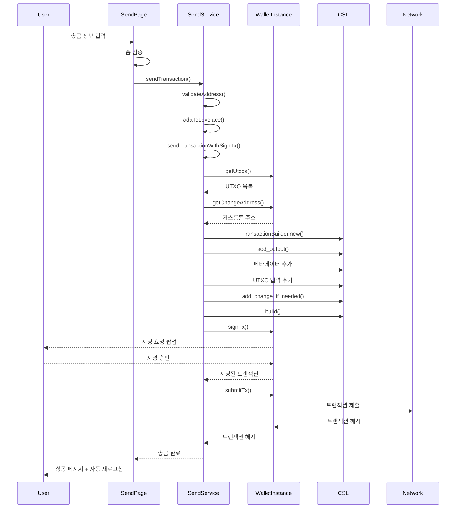
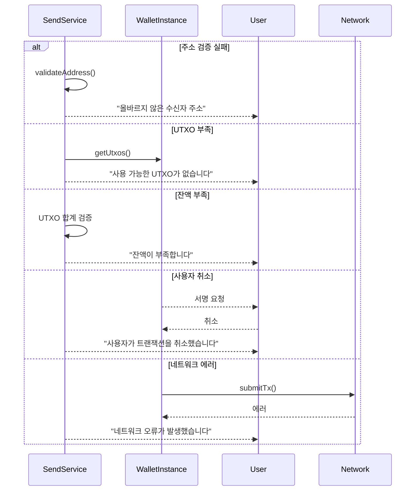

# 송금 시퀀스 다이어그램

## 송금 프로세스 전체 플로우

```mermaid
sequenceDiagram
    participant User
    participant SendPage
    participant SendService
    participant WalletInstance
    participant CSL
    participant Network

    User->>SendPage: 송금 정보 입력
    SendPage->>SendPage: 폼 검증
    SendPage->>SendService: sendTransaction()

    SendService->>SendService: validateAddress()
    SendService->>SendService: adaToLovelace()
    SendService->>SendService: sendTransactionWithSignTx()

    SendService->>WalletInstance: getUtxos()
    WalletInstance-->>SendService: UTXO 목록

    SendService->>WalletInstance: getChangeAddress()
    WalletInstance-->>SendService: 거스름돈 주소

    SendService->>CSL: TransactionBuilder.new()
    SendService->>CSL: add_output()
    SendService->>CSL: 메타데이터 추가
    SendService->>CSL: UTXO 입력 추가
    SendService->>CSL: add_change_if_needed()
    SendService->>CSL: build()

    SendService->>WalletInstance: signTx()
    WalletInstance-->>User: 서명 요청 팝업
    User-->>WalletInstance: 서명 승인
    WalletInstance-->>SendService: 서명된 트랜잭션

    SendService->>WalletInstance: submitTx()
    WalletInstance->>Network: 트랜잭션 제출
    Network-->>WalletInstance: 트랜잭션 해시
    WalletInstance-->>SendService: 트랜잭션 해시

    SendService-->>SendPage: 송금 완료
    SendPage-->>User: 성공 메시지 + 자동 새로고침
```

## 에러 처리 플로우

```mermaid
sequenceDiagram
    participant SendService
    participant WalletInstance
    participant User

    alt 주소 검증 실패
        SendService->>SendService: validateAddress()
        SendService-->>User: "올바르지 않은 수신자 주소"
    else UTXO 부족
        SendService->>WalletInstance: getUtxos()
        SendService-->>User: "사용 가능한 UTXO가 없습니다"
    else 잔액 부족
        SendService->>SendService: UTXO 합계 검증
        SendService-->>User: "잔액이 부족합니다"
    else 사용자 취소
        WalletInstance-->>User: 서명 요청
        User-->>WalletInstance: 취소
        SendService-->>User: "사용자가 트랜잭션을 취소했습니다"
    else 네트워크 에러
        WalletInstance->>Network: submitTx()
        Network-->>WalletInstance: 에러
        SendService-->>User: "네트워크 오류가 발생했습니다"
    end
```
