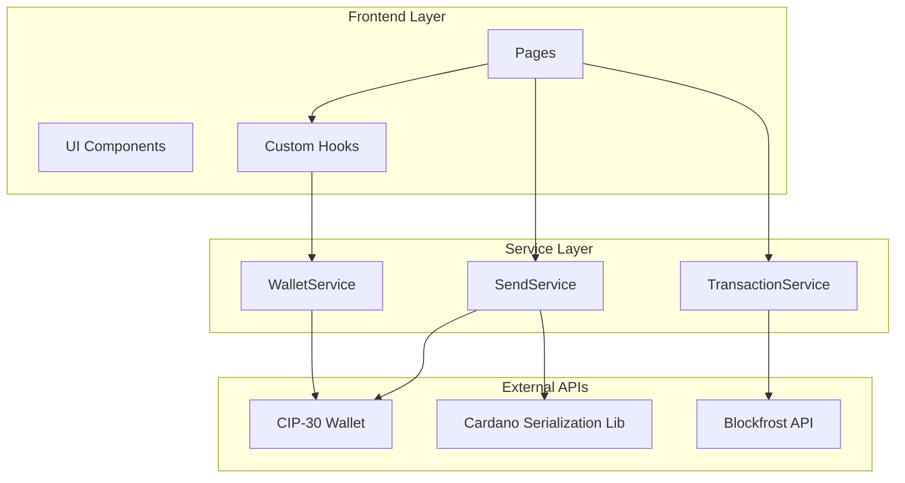

# 서비스 아키텍처

## 전체 시스템 아키텍처

## 서비스별 상세 구조

| 서비스                 | 역할           | 주요 메서드                                                     | 의존성          |
| ---------------------- | -------------- | --------------------------------------------------------------- | --------------- |
| **WalletService**      | 지갑 연결/관리 | `connectWallet()`, `getAvailableWallets()`, `isWalletEnabled()` | CIP-30 API      |
| **SendService**        | 송금 처리      | `sendTransaction()`, `validateAddress()`, `estimateFee()`       | CIP-30 API, CSL |
| **TransactionService** | 거래내역 조회  | `getTransactionHistory()`, `getTransactionDetails()`            | Blockfrost API  |

## 컴포넌트별 구조

| 레이어         | 컴포넌트         | 역할               | 의존성                        |
| -------------- | ---------------- | ------------------ | ----------------------------- |
| **Pages**      | `WalletPage`     | 지갑 관리 UI       | `useWallet`, `WalletService`  |
| **Pages**      | `SendPage`       | 송금 UI            | `useWallet`, `SendService`    |
| **Pages**      | `HistoryPage`    | 거래내역 UI        | `useWallet`, `useTransaction` |
| **Hooks**      | `useWallet`      | 지갑 상태 관리     | `WalletService`               |
| **Hooks**      | `useTransaction` | 거래 상태 관리     | `TransactionService`          |
| **Components** | `WalletConnect`  | 지갑 연결 컴포넌트 | `useWallet`                   |
| **Components** | `WalletInfo`     | 지갑 정보 표시     | `useWallet`                   |
