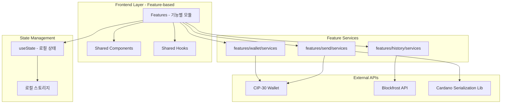

# 서비스 아키텍처

## 전체 시스템 아키텍처



## 서비스별 상세 구조

| 서비스                        | 역할           | 주요 메서드                                                     | 의존성          |
| ----------------------------- | -------------- | --------------------------------------------------------------- | --------------- |
| **features/wallet/services**  | 지갑 연결/관리 | `connectWallet()`, `getAvailableWallets()`, `isWalletEnabled()` | CIP-30 API      |
| **features/send/services**    | 송금 처리      | `sendTransaction()`, `validateAddress()`, `estimateFee()`       | CIP-30 API, CSL |
| **features/history/services** | 거래내역 조회  | `getTransactionHistory()`, `getTransactionDetails()`            | Blockfrost API  |

## Feature 모듈별 구조

| Feature     | 컴포넌트          | 역할               | 의존성                       |
| ----------- | ----------------- | ------------------ | ---------------------------- |
| **wallet**  | `WalletPage`      | 지갑 관리 UI       | `useWallet`, `walletService` |
| **wallet**  | `WalletConnect`   | 지갑 연결 컴포넌트 | `walletService`              |
| **wallet**  | `WalletInfo`      | 지갑 정보 표시     | `walletTypes`                |
| **send**    | `SendPage`        | 송금 UI            | `useWallet`, `sendService`   |
| **send**    | `SendForm`        | 송금 폼            | `sendService`                |
| **history** | `HistoryPage`     | 거래내역 UI        | `useTransaction`             |
| **history** | `TransactionList` | 거래 목록 표시     | `transactionTypes`           |
| **shared**  | `useWallet`       | 지갑 상태 관리     | `walletService`, `useState`  |
| **shared**  | `useTransaction`  | 거래 상태 관리     | `transactionService`         |

## Feature-based 아키텍처 특징

### 1. Feature별 독립 구조

```
src/features/
├── wallet/
│   ├── components/
│   │   ├── WalletConnect.tsx  # 지갑 연결 컴포넌트
│   │   └── WalletInfo.tsx     # 지갑 정보 컴포넌트
│   ├── pages/
│   │   └── WalletPage.tsx     # 지갑 페이지
│   ├── services/
│   │   └── walletService.ts   # 지갑 서비스
│   ├── hooks/
│   │   └── useWallet.ts       # 지갑 훅
│   ├── types/
│   │   └── walletTypes.ts     # 지갑 타입
│   └── styles/                # 지갑 관련 스타일
├── send/
│   ├── components/
│   │   ├── AddressInput.tsx   # 주소 입력
│   │   ├── AmountInput.tsx    # 금액 입력
│   │   └── SendForm.tsx       # 송금 폼
│   └── (동일한 구조)
└── history/
    ├── components/
    │   ├── TransactionCard.tsx    # 거래 카드
    │   ├── TransactionList.tsx    # 거래 리스트
    │   └── TransactionFilter.tsx  # 필터
    └── (동일한 구조)
```

### 2. 공통 요소 분리

```
src/shared/
├── components/
│   ├── Button/                # 공통 버튼
│   ├── Card/                  # 공통 카드
│   ├── Modal/                 # 공통 모달
│   ├── Loading/               # 공통 로딩
│   └── Layout/                # 공통 레이아웃
├── hooks/                     # 공통 훅
├── services/                  # 공통 서비스
├── styles/                    # 전역 스타일
│   ├── globals.css
│   ├── theme.css             # tweakcn 테마
│   └── antd-override.css     # Ant Design 오버라이드
└── utils/                     # 유틸리티
```

### 3. 상태 관리 전략

- **로컬 상태**: React `useState` 활용
- **비즈니스 로직**: Custom Hooks (`useWallet`, `useTransaction`)
- **전역 상태**: 필요시에만 간단한 Context 사용
- **영속성**: 로컬 스토리지 활용

## 서비스 레이어 설계 원칙

### 1. 단일 책임 원칙

- `WalletService`: 지갑 연결과 상태 관리만
- `SendService`: 송금 관련 로직만
- `TransactionService`: 거래내역 조회만

### 2. 의존성 최소화

- 각 서비스는 독립적으로 동작
- 외부 API에 대한 명확한 인터페이스 정의
- 에러 처리는 각 서비스 레이어에서 처리

### 3. 타입 안전성

- TypeScript 기반 강타입 시스템
- CIP-30 표준 인터페이스 준수
- 런타임 검증과 컴파일 타임 검증 병행
