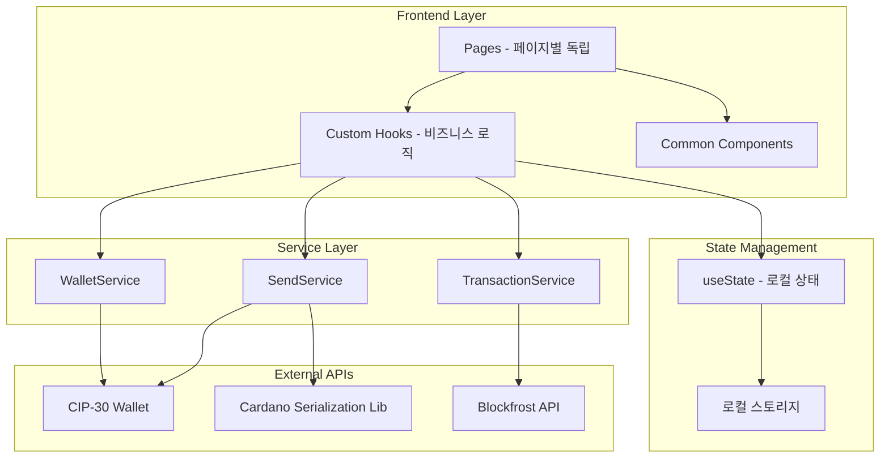

# 서비스 아키텍처

## 전체 시스템 아키텍처



## 서비스별 상세 구조

| 서비스                 | 역할           | 주요 메서드                                                     | 의존성          |
| ---------------------- | -------------- | --------------------------------------------------------------- | --------------- |
| **WalletService**      | 지갑 연결/관리 | `connectWallet()`, `getAvailableWallets()`, `isWalletEnabled()` | CIP-30 API      |
| **SendService**        | 송금 처리      | `sendTransaction()`, `validateAddress()`, `estimateFee()`       | CIP-30 API, CSL |
| **TransactionService** | 거래내역 조회  | `getTransactionHistory()`, `getTransactionDetails()`            | Blockfrost API  |

## 컴포넌트별 구조

| 레이어         | 컴포넌트         | 역할               | 의존성                        |
| -------------- | ---------------- | ------------------ | ----------------------------- |
| **Pages**      | `WalletPage`     | 지갑 관리 UI       | `useWallet`, `WalletService`  |
| **Pages**      | `SendPage`       | 송금 UI            | `useWallet`, `SendService`    |
| **Pages**      | `HistoryPage`    | 거래내역 UI        | `useWallet`, `useTransaction` |
| **Hooks**      | `useWallet`      | 지갑 상태 관리     | `WalletService`, `useState`   |
| **Hooks**      | `useTransaction` | 거래 상태 관리     | `TransactionService`          |
| **Components** | `WalletConnect`  | 지갑 연결 컴포넌트 | `useWallet`                   |
| **Components** | `WalletInfo`     | 지갑 정보 표시     | `useWallet`                   |

## 페이지 중심 아키텍처 특징

### 1. 페이지별 독립 구조

```
src/pages/
├── wallet/
│   ├── index.tsx              # 지갑 페이지 메인
│   ├── WalletConnect.tsx      # 지갑 연결 (지갑 페이지 전용)
│   └── WalletInfo.tsx         # 지갑 정보 (지갑 페이지 전용)
├── send/
│   ├── index.tsx              # 송금 페이지 메인
│   ├── AddressInput.tsx       # 주소 입력 (송금 페이지 전용)
│   ├── AmountInput.tsx        # 금액 입력 (송금 페이지 전용)
│   └── SendForm.tsx           # 송금 폼 (송금 페이지 전용)
└── history/
    ├── index.tsx              # 거래내역 페이지 메인
    ├── TransactionCard.tsx    # 거래 카드 (거래내역 페이지 전용)
    ├── TransactionList.tsx    # 거래 리스트 (거래내역 페이지 전용)
    └── TransactionFilter.tsx  # 필터 (거래내역 페이지 전용)
```

### 2. 공통 요소 분리

```
src/components/common/
├── Button/                    # 공통 버튼
├── Card/                      # 공통 카드
├── Modal/                     # 공통 모달
├── Loading/                   # 공통 로딩
└── Layout/                    # 공통 레이아웃
```

### 3. 상태 관리 전략

- **로컬 상태**: React `useState` 활용
- **비즈니스 로직**: Custom Hooks (`useWallet`, `useTransaction`)
- **전역 상태**: 필요시에만 간단한 Context 사용
- **영속성**: 로컬 스토리지 활용

## 서비스 레이어 설계 원칙

### 1. 단일 책임 원칙

- `WalletService`: 지갑 연결과 상태 관리만
- `SendService`: 송금 관련 로직만
- `TransactionService`: 거래내역 조회만

### 2. 의존성 최소화

- 각 서비스는 독립적으로 동작
- 외부 API에 대한 명확한 인터페이스 정의
- 에러 처리는 각 서비스 레이어에서 처리

### 3. 타입 안전성

- TypeScript 기반 강타입 시스템
- CIP-30 표준 인터페이스 준수
- 런타임 검증과 컴파일 타임 검증 병행
