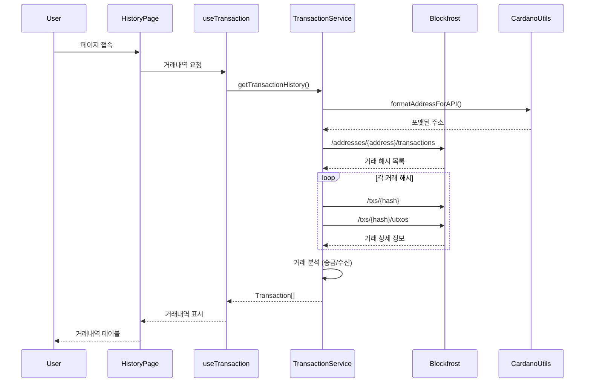
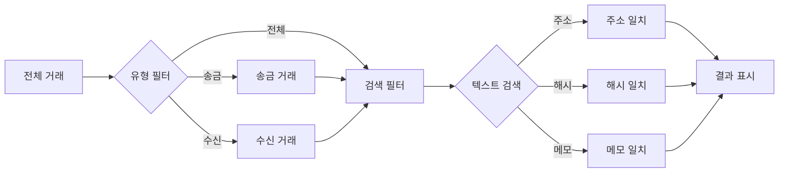

# 거래내역 시퀀스 다이어그램

## 거래내역 조회 프로세스



## 거래 분석 로직

```mermaid
flowchart TD
    Start([거래 데이터 수신]) --> GetIOData[입력/출력 데이터 추출]
    GetIOData --> CalcUserInputs[사용자 입력 ADA 계산]
    CalcUserInputs --> CalcUserOutputs[사용자 출력 ADA 계산]
    CalcUserOutputs --> CalcNetChange[순 변화량 계산]

    CalcNetChange --> CheckNetChange{순 변화량 > 0?}
    CheckNetChange -->|Yes| SetReceived[거래 유형: 수신]
    CheckNetChange -->|No| SetSent[거래 유형: 송금]

    SetReceived --> CalcReceivedAmount[수신 금액 = 순 변화량]
    SetSent --> CalcSentAmount[송금 금액 = |순 변화량|]

    CalcReceivedAmount --> FindSender[발신자 주소 찾기]
    CalcSentAmount --> FindReceiver[수신자 주소 찾기]

    FindSender --> ExtractMetadata[메타데이터 추출]
    FindReceiver --> ExtractMetadata
    ExtractMetadata --> End([거래 객체 반환])
```

## 거래 상태별 처리

| 상태       | 표시      | 색상   | 아이콘 |
| ---------- | --------- | ------ | ------ |
| **확인됨** | Confirmed | 초록색 | ✅     |
| **대기중** | Pending   | 노란색 | ⏳     |
| **실패**   | Failed    | 빨간색 | ❌     |

## 필터링 및 검색


