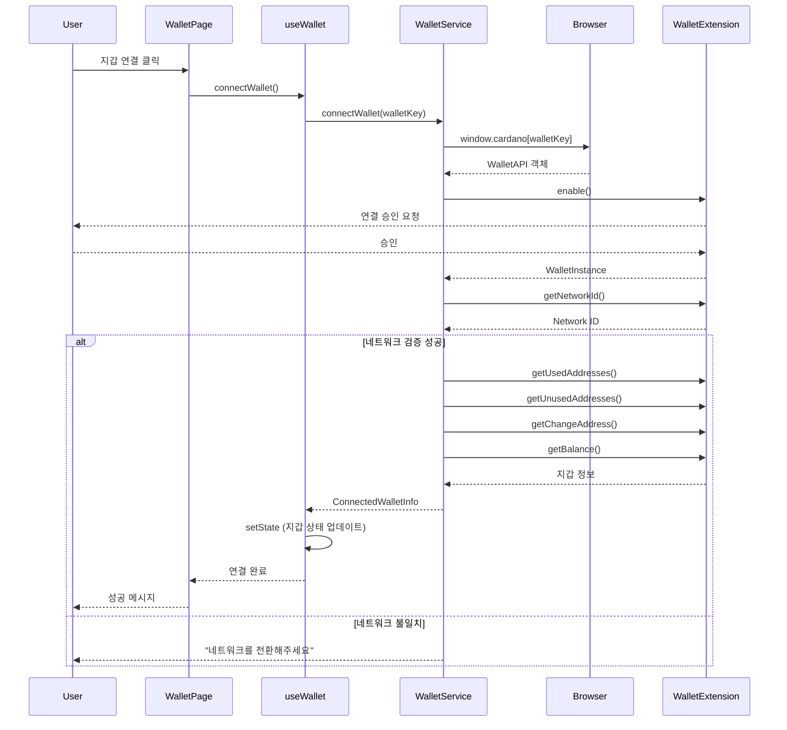
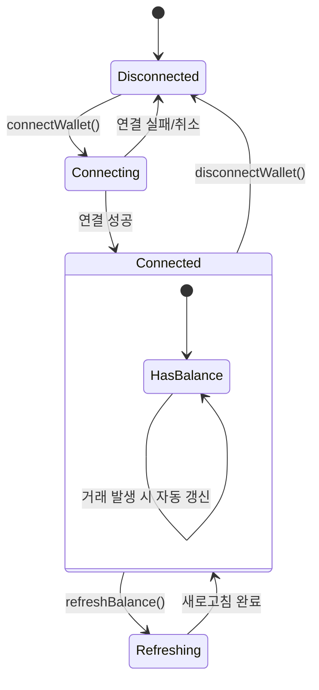
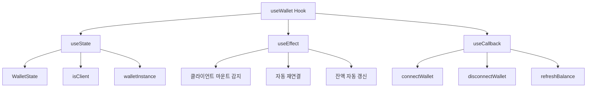
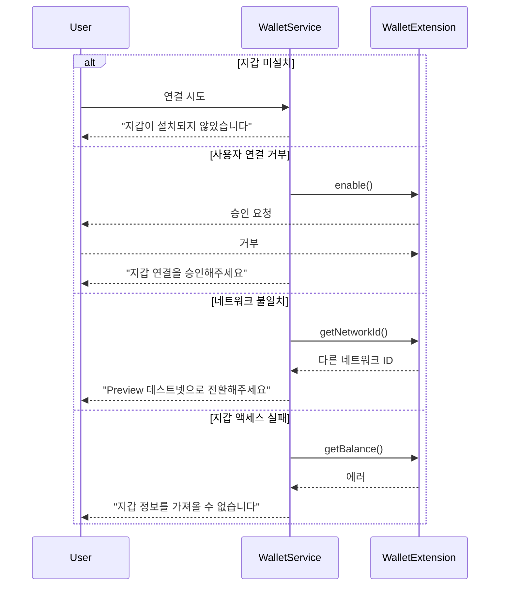
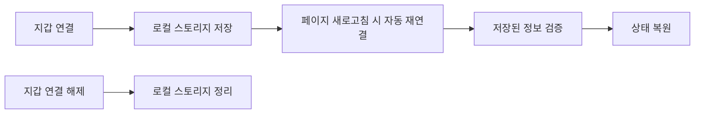

# 지갑 연결 시퀀스 다이어그램

## 지갑 연결 프로세스

## 지갑 상태 관리 (useState 기반)

## useWallet Hook 내부 구조

## 지갑별 호환성 매트릭스

| 지갑       | CIP-30 지원 | send API | 메타데이터 | 멀티시그 | 테스트 결과 |
| ---------- | ----------- | -------- | ---------- | -------- | ----------- |
| **Lace**   | ✅          | ❌       | ✅         | ❌       | ✅          |
| **Nami**   | ✅          | ❌       | ✅         | ❌       | ✅          |
| **Eternl** | ✅          | ⚠️       | ✅         | ✅       | ✅          |

**범례**: ✅ 완전 지원, ⚠️ 부분 지원, ❌ 미지원

## 에러 처리 시나리오

## 로컬 스토리지 연동

