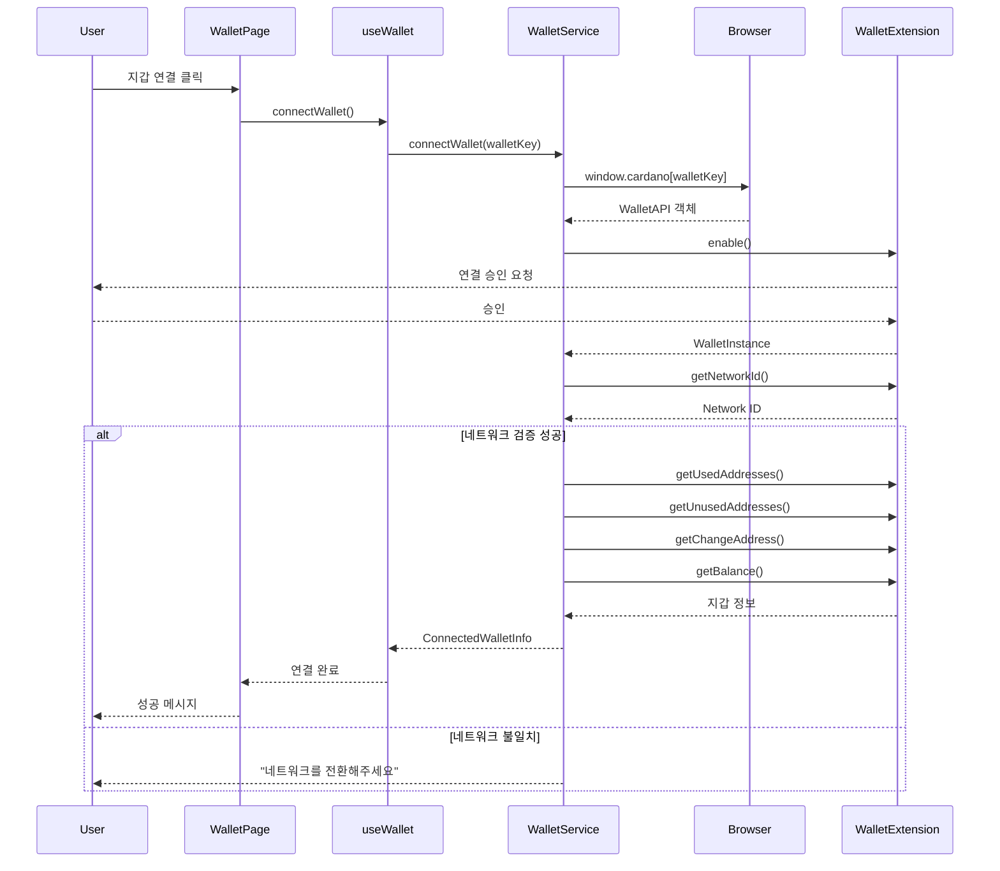
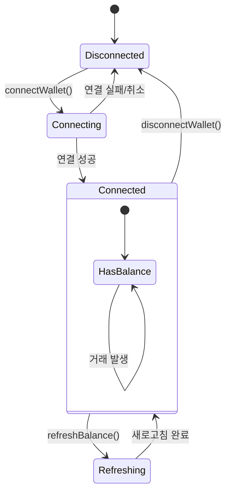

# 지갑 연결 시퀀스 다이어그램

## 지갑 연결 프로세스

## 지갑 상태 관리

## 지갑별 호환성 매트릭스

| 지갑       | CIP-30 지원 | send API | 메타데이터 | 멀티시그 |
| ---------- | ----------- | -------- | ---------- | -------- |
| **Lace**   | ✅          | ❌       | ✅         | ❌       |
| **Nami**   | ✅          | ❌       | ✅         | ❌       |
| **Eternl** | ✅          | ⚠️       | ✅         | ✅       |
| **Flint**  | ✅          | ❌       | ✅         | ❌       |
| **Yoroi**  | ✅          | ❌       | ✅         | ❌       |

**범례**: ✅ 완전 지원, ⚠️ 부분 지원, ❌ 미지원
